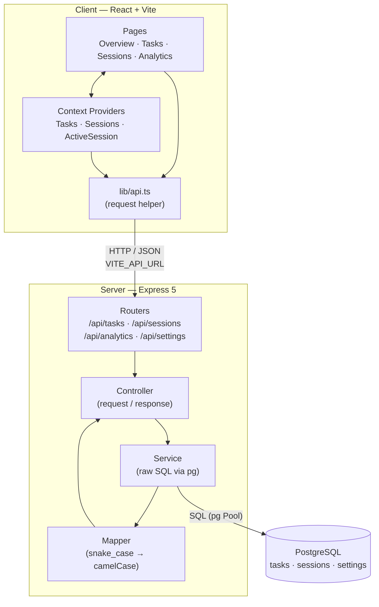
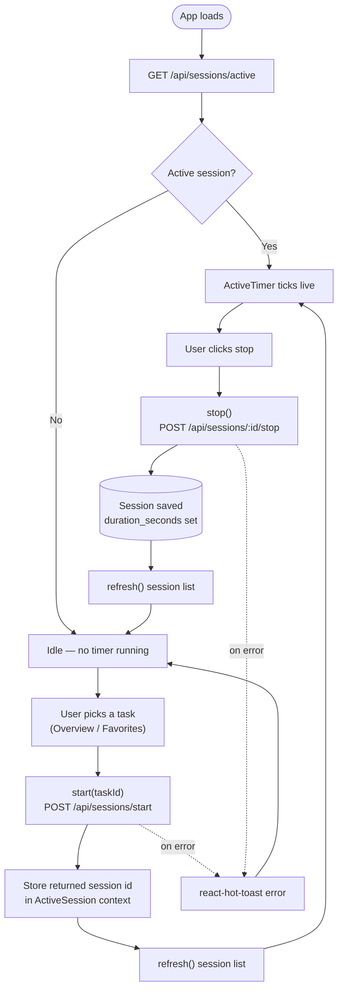

# Jikan Time Ledger

A personal time-tracking and task management app. Track work sessions against tasks, run a live timer, review your session history, and see analytics on how you spend your time. *("Jikan" / 時間 means "time" in Japanese.)*

## Features

- **Tasks** — full CRUD with emoji, color, and favorites
- **Active timer** — start/stop a live session against any task; survives page refresh
- **Sessions** — history grouped by day, filterable per task
- **Overview dashboard** — working hours, "tracked today" stats, current tasks, and favorites
- **Analytics** — daily hours chart, time distribution per task, and summary stats with `today / 7d / 30d` presets
- **Persistence** — everything is backed by a PostgreSQL database via the API

## Tech Stack

| Layer    | Tech                                       |
| -------- | ------------------------------------------ |
| Frontend | React 19 + TypeScript + Vite               |
| Styling  | Tailwind CSS v4                            |
| Routing  | React Router v7                            |
| Charts   | Recharts                                   |
| Toasts   | react-hot-toast                            |
| Backend  | Node + Express 5 + TypeScript (tsx in dev) |
| Database | PostgreSQL via `pg` (raw SQL + migrations) |

## Project Structure

```
jikan-time-ledger/
├── client/                 # React + Vite frontend
│   └── src/
│       ├── components/      # Layout + shared UI primitives
│       ├── context/         # Tasks, Sessions, ActiveSession providers
│       ├── features/        # Pages + feature components (overview, tasks, sessions, analytics)
│       ├── lib/api.ts       # Frontend API client
│       └── types/           # Shared Task / Session types
└── server/                 # Express + Postgres API
    ├── src/
    │   ├── config/db.ts     # pg Pool from DATABASE_URL
    │   ├── features/        # tasks / sessions / analytics / settings
    │   │                    #   (controller / service / routes / mapper)
    │   ├── migrate.ts       # Tracked migration runner
    │   └── server.ts        # App entry: mounts routers, listens on :4000
    └── migrations/          # SQL schema (001_init.sql, 002_add_settings.sql)
```

The frontend uses three nested providers (`TasksProvider` → `SessionsProvider` → `ActiveSessionProvider`) for global state. The backend follows a consistent **controller / service / routes / mapper** split per feature.

## Architecture



### Time-Tracking Flow

The core loop of starting, running, and stopping a timed session:



## Getting Started

### Prerequisites

- Node.js
- PostgreSQL running locally

### 1. Backend

```bash
cd server
npm install
```

Ensure `server/.env` has your database connection string (and optional port):

```env
DATABASE_URL=postgresql://<user>@localhost:5432/jikan
PORT=4000
```

Create the database (if it doesn't exist), apply the schema, then start the API:

```bash
createdb jikan        # or create the "jikan" DB however you prefer
npm run migrate       # applies all pending migrations/*.sql
npm run dev           # starts the API on http://localhost:4000
```

### 2. Frontend

```bash
cd client
npm install
npm run dev           # starts the Vite dev server
```

Open the URL Vite prints (default `http://localhost:5173`). The client talks to the API at `http://localhost:4000/api` by default; override it with a `VITE_API_URL` env var if your API runs elsewhere.

## Scripts

### Client (`client/`)

| Script            | Description                  |
| ----------------- | ---------------------------- |
| `npm run dev`     | Start the Vite dev server    |
| `npm run build`   | Type-check and build         |
| `npm run preview` | Preview the production build  |
| `npm run lint`    | Run ESLint                   |

### Server (`server/`)

| Script            | Description                            |
| ----------------- | -------------------------------------- |
| `npm run dev`     | Start the API in watch mode (tsx)      |
| `npm run migrate` | Apply all pending SQL migrations       |
| `npm run build`   | Compile TypeScript to `dist/`          |
| `npm start`       | Run the compiled server                |

## API Overview

Base URL: `http://localhost:4000`

| Method   | Endpoint                  | Description                          |
| -------- | ------------------------- | ------------------------------------ |
| `GET`    | `/api/tasks`              | List tasks                           |
| `POST`   | `/api/tasks`              | Create a task                        |
| `PATCH`  | `/api/tasks/:id`          | Update a task (e.g. toggle favorite) |
| `DELETE` | `/api/tasks/:id`          | Delete a task                        |
| `POST`   | `/api/sessions/start`     | Start an active session              |
| `POST`   | `/api/sessions/:id/stop`  | Stop a session                       |
| `GET`    | `/api/sessions`           | List sessions                        |
| `GET`    | `/api/sessions/active`    | Get the current running session      |
| `GET`    | `/api/analytics`          | Analytics (`?period=today\|yesterday\|7d\|30d`) |
| `GET`    | `/api/settings`           | Get working-hours settings           |
| `PATCH`  | `/api/settings`           | Update working-hours settings        |

## Database

Two migrations define the schema:

- `001_init.sql` — `tasks` and `sessions` (sessions cascade-delete with their task)
- `002_add_settings.sql` — `settings` table for working-hours persistence

Migrations are applied by a tracked runner (`server/src/migrate.ts`) that records each applied file in a `schema_migrations` table and runs pending migrations in a transaction.
